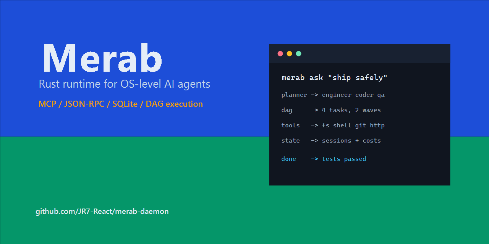

# Merab

[](https://github.com/JR7-React/merab-daemon/actions/workflows/ci.yml)




Merab is a local Rust runtime for orchestrating AI agents at the operating-system level. It provides a CLI, a JSON-RPC daemon, local persistence, MCP/A2A transports, sandboxing hooks, background jobs, project memory, code indexing, and a multi-agent task pipeline.

> Status: experimental. Merab is useful for local exploration and agent-runtime research, but the API and storage schema can still change between sprints.

## Why Merab?

- **Local-first agent runtime:** run the daemon and tools on your own machine.
- **Multi-agent execution:** split work into planner-generated DAG subtasks.
- **Practical tool bridge:** connect agents to filesystem, shell, git, HTTP, MCP, and A2A flows.
- **Session memory:** persist conversations, artifacts, token usage, jobs, and project context.

## Demo In 60 Seconds

```bash
cargo build --workspace
cargo run -p merab-daemon --bin merabd
cargo run -p merab-cli --bin merab -- ask "summarize this repo and list the crates"
```

Typical flow:

```text
merab ask "ship the feature safely"
planner  -> decomposes task into subtasks
dag      -> runs ready tasks in waves
tools    -> calls fs, shell, git, http agents
session  -> saves artifacts, cost, and final summary
```

## What Merab Does

- Runs `merab ask "task"` and decomposes work into planner-generated subtasks.
- Executes subtasks through specialized personas such as engineer, coder, reviewer, and QA.
- Talks to local MCP agents for filesystem, shell, git, HTTP, and test helper workflows.
- Persists sessions, conversations, memory, tasks, jobs, cache entries, and code index data in SQLite.
- Supports streaming output, background jobs, watch mode, doctor checks, and multi-project switching.
- Keeps local LLM provider configuration outside the public repository.

## Workspace

| Crate | Purpose |
| --- | --- |
| `merab-core` | Shared types, errors, sessions, artifacts, tasks, pricing, events |
| `merab-config` | Configuration loading from defaults, user config, local config, and `MERAB__*` env vars |
| `merab-store` | SQLite persistence through `rusqlite` |
| `merab-ai` | OpenAI-compatible chat client and streaming helpers |
| `merab-daemon` | `merabd` JSON-RPC daemon, planner, DAG execution, jobs, proxy, registry |
| `merab-cli` | `merab` CLI, chat UI, bootstrap, sessions, config, doctor, review, watch |
| `merab-transport` | MCP and A2A client/server transport helpers |
| `merab-sandbox` | Windows Job Objects and Unix sandbox scaffolding |
| `merab-tui` | Terminal monitor UI with `ratatui` |
| `merab-fs` | MCP filesystem agent |
| `merab-shell` | MCP shell-command agent |
| `merab-git` | MCP git agent |
| `merab-http` | MCP HTTP agent |
| `merab-echo` | MCP echo/testing agent |

## Requirements

- Rust stable with edition 2024 support.
- Windows: Visual Studio Build Tools or a compatible MinGW toolchain.
- Unix-like systems: standard libc toolchain.
- Optional: an OpenAI-compatible LLM provider key for `ask`, chat, planning, and review workflows.

## Quick Start

```bash
cargo build --workspace
cargo test --workspace

# Run the daemon in one terminal.
cargo run -p merab-daemon --bin merabd

# Use the CLI from another terminal.
cargo run -p merab-cli --bin merab -- doctor
cargo run -p merab-cli --bin merab -- ask "summarize this repository"
```

After installing the binaries, the same commands become:

```bash
merabd
merab doctor
merab ask "summarize this repository"
```

## Configuration

Do not commit real API keys. Use one of these local-only options:

```bash
# Environment variable
MERAB_PROXY__API_KEY=replace-with-your-provider-key

# Or the user config file managed by the CLI
merab config set proxy.api_key replace-with-your-provider-key
```

For a complete local config template, copy `merab.example.toml` to `merab.toml`. The real `merab.toml` file is ignored by Git on purpose.

## Common Commands

```bash
merab                         # interactive chat
merab ask "task"              # Plan -> DAG -> execute
merab ask "task" --bg         # run in background
merab plan "task"             # plan without executing
merab sessions                # list sessions for the active project
merab continue [id]           # resume a previous session
merab doctor                  # diagnose daemon, config, proxy, agents
merab index build             # index Rust symbols for search
merab review                  # AI-assisted code review
merab projects list           # list known projects
```

More command details live in [docs/cli-commands.md](docs/cli-commands.md).

## Development Rules

- Rust edition 2024.
- Do not use `unwrap()` in production code; propagate or map errors.
- Libraries use `thiserror`; binaries use `anyhow`.
- Daemon and store logs use `tracing`, not `println!`.
- Put tests near the code they verify or under the crate `tests/` directory.
- Keep new source files focused and avoid large catch-all modules.

Run before opening a PR:

```bash
cargo build --workspace
cargo test --workspace
```

## Security

Merab is a local runtime that can execute tools and shell commands through agents. Treat manifests, configs, memory entries, and prompts as sensitive operational inputs.

- Never commit real provider keys, local configs, SQLite databases, logs, or tool-state directories.
- Rotate any key that was ever committed, even if it was removed later.
- Review [SECURITY.md](SECURITY.md) before reporting vulnerabilities.

## Documentation

- [docs/README.md](docs/README.md) - documentation index
- [docs/cli-commands.md](docs/cli-commands.md) - CLI reference
- [docs/index.html](docs/index.html) - GitHub Pages landing page
- [docs/promotion-plan.md](docs/promotion-plan.md) - launch/promotion checklist
- [docs/public-release-checklist.md](docs/public-release-checklist.md) - checks before making the repository public
- [plans/](plans/) - sprint plans and implementation notes
- [AGENTS.md](AGENTS.md) - working context for AI coding agents

## License

MIT. See [LICENSE](LICENSE).
