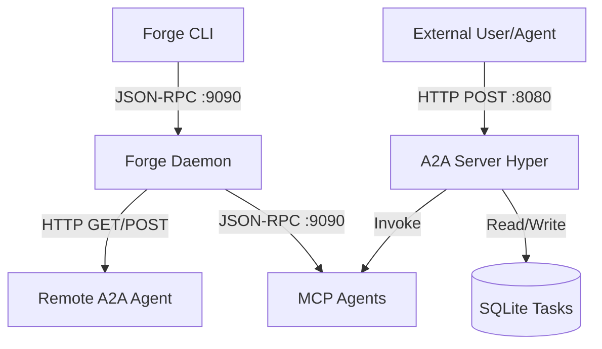

# Sprint 2.4 — A2A Protocol Implementation

**Estado**: Completado
**Commit**: (Pendiente de commit)

## Objetivo
Habilitar la comunicación Agente-a-Agente (A2A) mediante un servidor HTTP dedicado (Puerto 8080) y un cliente de descubrimiento, permitiendo que Forge exponga sus agentes MCP como "Skills" y consuma agentes remotos.

## Arquitectura Implementada

Se añadió un servidor HTTP (Hyper) al daemon `forged` que corre en paralelo al servidor JSON-RPC existente (9090).

## Componentes Clave

### 1. Servidor A2A (`crates/forge-daemon/src/a2a_server.rs`)
Servidor HTTP escuchando en puerto 8080.
- **GET `/.well-known/agent.json`**: Retorna la `AgentCard` del runtime.
  - Consulta dinámicamente al `McpManager`.
  - Itera sobre todos los agentes MCP conectados.
  - Llama a `list_tools` en cada uno para construir la lista de `skills`.
- **POST `/` (JSON-RPC 2.0)**:
  - `tasks/send`: Recibe una solicitud de ejecución de tarea.
    - Persiste la tarea en SQLite (estado `Pending`).
    - Busca el agente MCP que posee la herramienta solicitada.
    - Invoca la herramienta (`call_tool`) con los argumentos proporcionados.
    - Actualiza el estado de la tarea en DB (`Completed` o `Failed`) con el resultado.
  - `tasks/get`: Retorna el estado y resultado de una tarea por ID.

### 2. Cliente A2A (`crates/forge-transport/src/a2a.rs`)
Cliente HTTP (`hyper`) para consumir agentes remotos.
- `A2aClient::fetch_card(url)`: Descubre capacidades de un agente remoto.
- `A2aClient::send_task(url, skill, input)`: Envía una tarea a un agente remoto.

### 3. Persistencia (`crates/forge-store/src/tasks.rs`)
Nueva tabla `tasks` en SQLite para rastrear el ciclo de vida de las solicitudes A2A.
- Campos: `id`, `source`, `target` (skill), `input`, `status`, `output`, `error`, `created_at`, `updated_at`.
- Estados: `Pending`, `Running`, `Completed`, `Failed`, `Cancelled`.

### 4. CLI (`forge`)
Nuevos comandos para interactuar con el protocolo A2A:
- `forge a2a-discover <url>`: Muestra la `AgentCard` de un nodo remoto.
- `forge a2a-send <url> <skill> <input_json>`: Envía una tarea y muestra el resultado.

## Cambios en dependencias

Se añadieron las siguientes dependencias al workspace y crates específicos:
- `hyper` (v1), `hyper-util`, `http-body-util`: Para el servidor y cliente HTTP.
- `tower`, `bytes`: Utilidades de red.
- `url`: Manejo de URLs.

## Validación
- El código compila correctamente.
- La lógica de descubrimiento y enrutamiento de tareas está implementada y conecta el mundo HTTP (A2A) con el mundo local (MCP).
