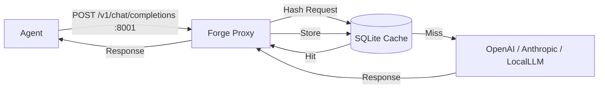

# Sprint 2.5 — Context Proxy (LLM Cache)

**Estado**: Completado
**Commit**: (Pendiente de commit)

## Objetivo
Implementar un proxy inverso compatible con la API de OpenAI que intercepte solicitudes a LLMs, cachee las respuestas idénticas y reduzca costos y latencia.

## Arquitectura

El `Forge Daemon` levanta un tercer servicio HTTP en el puerto **8001** que actúa como intermediario transparente.

## Componentes Implementados

### 1. Servidor Proxy (`crates/forge-daemon/src/proxy.rs`)
- **Puerto**: 8001.
- **Tecnología**: `hyper` (servidor) + `reqwest` (cliente upstream).
- **Lógica**:
  - Normaliza el cuerpo JSON de la solicitud.
  - Calcula un hash SHA-256 del JSON normalizado.
  - Verifica si existe en la base de datos `llm_cache`.
  - **Hit**: Retorna la respuesta guardada inmediatamente.
  - **Miss**: Reenvía la solicitud al upstream (e.g., api.openai.com).
    - Si la respuesta es exitosa (200 OK), guarda la respuesta en DB y la devuelve al cliente.
    - Si falla, devuelve el error sin cachear.
  - **Streaming**: Las solicitudes con `stream: true` se detectan y se reenvían directamente sin cachear (bypass).

### 2. Persistencia (`crates/forge-store/src/cache.rs`)
- **Tabla**: `llm_cache`.
- **Campos**: `hash`, `request` (JSON), `response` (JSON), `model`, `provider`, `hits`.
- **Índice**: `idx_cache_hash` para búsquedas rápidas.

### 3. Configuración (`.env`)
El proxy se configura mediante variables de entorno:
- `FORGE_PROXY_UPSTREAM_URL`: URL base del proveedor (default: `https://api.openai.com/v1`).
- `FORGE_PROXY_API_KEY`: API Key para inyectar si el cliente no la envía.

## Dependencias Añadidas
- `reqwest`: Cliente HTTP robusto para upstream.
- `sha2`, `hex`: Hashing criptográfico.
- `dotenv`: Carga de configuración desde archivo `.env`.

## Uso
Para que un agente use el proxy, simplemente debe configurar su `OPENAI_BASE_URL` (o equivalente) a `http://localhost:8001/v1`.
