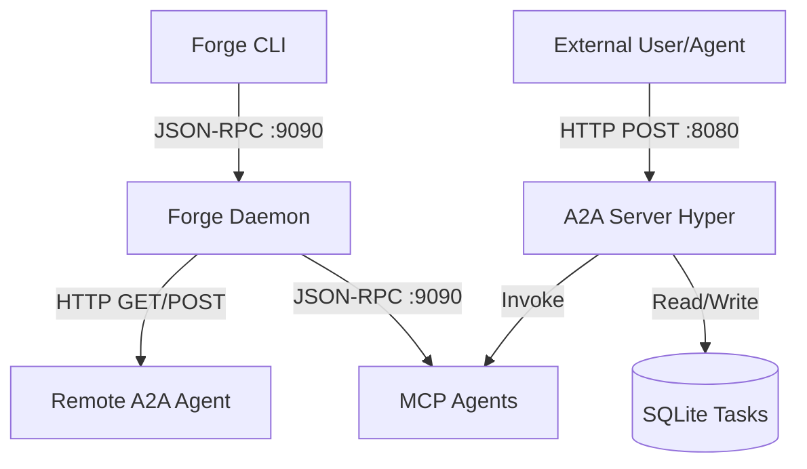

# Sprint 2.4 — A2A Protocol Implementation

**Estado**: Planificación
**Objetivo**: Habilitar la comunicación Agente-a-Agente (A2A) mediante un servidor HTTP dedicado (Puerto 8080) y un cliente de descubrimiento, permitiendo que Forge exponga sus agentes MCP como "Skills" y consuma agentes remotos.

## 1. Arquitectura de Componentes

Se añade un segundo servidor (HTTP/Hyper) al daemon `forged` que corre en paralelo al servidor JSON-RPC existente.



## 2. Dependencias

Se añadirán al workspace `Cargo.toml` (probablemente en `forge-transport` y `forge-daemon`):

```toml
[dependencies]
# Transitivas de jsonrpsee, pero las haremos explícitas para el servidor A2A
hyper = { version = "1", features = ["full"] }
hyper-util = { version = "0.1", features = ["full"] }
http-body-util = "0.1"
tower = { version = "0.4", features = ["util"] }
bytes = "1"

# Protocolo (Asumimos que existe o lo definiremos si no está disponible públicamente)
# Si no existe el crate, definiremos los structs en forge-transport
# a2a-types = "0.1" 
```

## 3. Base de Datos (SQLite)

Nueva tabla `tasks` en `forge-store/src/db.rs` para rastrear el estado de las solicitudes A2A.

```sql
CREATE TABLE tasks (
    id          TEXT PRIMARY KEY,       -- UUID v4
    source      TEXT,                   -- Identificador del solicitante (e.g., remote URL)
    target      TEXT NOT NULL,          -- Nombre de la Skill/Tool local
    input       TEXT NOT NULL,          -- JSON input arguments
    status      TEXT NOT NULL,          -- 'pending', 'running', 'completed', 'failed'
    output      TEXT,                   -- JSON result
    error       TEXT,                   -- Error message if failed
    created_at  TEXT NOT NULL DEFAULT (datetime('now')),
    updated_at  TEXT NOT NULL DEFAULT (datetime('now'))
);
```

## 4. Estructura de Archivos y Cambios

### `crates/forge-transport/src/a2a.rs`
Definición de tipos (si no usamos el crate externo) y cliente HTTP básico.
- `struct AgentCard`: Define identidad y `skills`.
- `struct Task`: Define la estructura de envío y respuesta.
- `Client`: Métodos `fetch_card(url)` y `send_task(url, task)`.

### `crates/forge-store/src/tasks.rs` (Nuevo)
- `TasksDb` trait/impl para operaciones CRUD sobre la tabla `tasks`.

### `crates/forge-daemon/src/a2a_server.rs` (Nuevo)
El servidor Hyper escuchando en 8080.
- `start_a2a_server(addr, context)`
- Handler para `GET /.well-known/agent.json`:
  - Itera sobre `McpManager` -> `list_tools`.
  - Construye y retorna `AgentCard`.
- Handler para `POST /` (JSON-RPC A2A):
  - `tasks/send`: Crea registro en DB, busca herramienta MCP, invoca `call_tool`.
  - `tasks/get`: Retorna estado de la DB.
  - `tasks/cancel`: Marca como cancelado (best effort).

### `crates/forge-daemon/src/main.rs`
- Inicializar `A2AServer` en un `tokio::spawn` separado.
- Pasar referencias compartidas (`Arc<McpManager>`, `Arc<Database>`) al servidor A2A.

### `crates/forge-cli/src/main.rs`
Nuevos comandos:
- `forge discover <url>` -> Llama a RPC `forge.a2aDiscover`.
- `forge remote-send <url> <msg>` -> Llama a RPC `forge.a2aSend`.

## 5. Mapeo de Tipos (A2A <-> Interno)

| A2A Concept | Forge Concept | Notes |
|---|---|---|
| **Agent Card** | Aggregation of MCP Agents | Forge se presenta como un "Super Agente" que expone todas las tools instaladas como skills. |
| **Skill** | MCP Tool | `Tool.name` se convierte en `Skill.name`. |
| **Task Input** | Tool Arguments | El input del task se pasa directo como argumentos al MCP tool. |
| **Task Output** | Tool Result | El resultado del MCP se guarda como output del task. |

## 6. Flujo de Ejecución (Task)

1. **Recepción**: POST `/` con method `tasks/send`. Payload: `{ "skill": "search", "input": {"query": "rust"} }`.
2. **Persistencia**: Se crea `Task` en DB con status `pending`.
3. **Resolución**:
   - `A2AServer` busca en `McpManager` qué agente tiene la tool "search".
4. **Ejecución**:
   - Llama a `mcp_client.call_tool("search", args)`.
   - *Nota*: Para el MVP, la llamada puede ser síncrona (esperar resultado y responder HTTP) o asíncrona (responder TaskID y que el cliente haga polling). **Decisión MVP**: Síncrono si es rápido, o polling si el protocolo lo exige. Seguiremos el patrón de retornar TaskID para cumplir con A2A.
5. **Actualización**: Al terminar la tool, actualizar DB con `completed` y `output`.

## 7. Plan de Implementación Paso a Paso

1.  **Tipos y DB**: Definir structs A2A y migración SQLite.
2.  **Core A2A Logic**: Implementar lógica de `Tasks` en `forge-store`.
3.  **A2A Server Skeleton**: Levantar servidor Hyper en 8080 que responda 404.
4.  **Agent Card Endpoint**: Implementar `GET /.well-known/agent.json` conectando con `McpManager`.
5.  **Task Processing**: Implementar `POST` -> `tasks/send` conectando con `McpClient`.
6.  **Cliente y CLI**: Implementar comandos de descubrimiento y envío desde el CLI.
