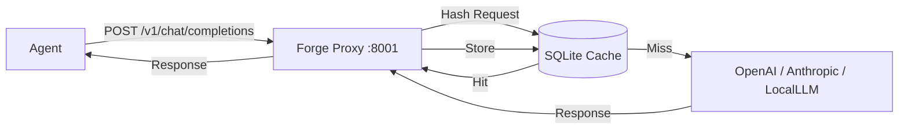

# Sprint 2.5 — Context Proxy (LLM Cache)

**Estado**: Planificación
**Objetivo**: Implementar un proxy inverso compatible con la API de OpenAI que intercepte solicitudes a LLMs, cachee las respuestas idénticas y reduzca costos y latencia.

## 1. Arquitectura

El `Forge Daemon` levantará un tercer servicio HTTP en el puerto **8001** (configurable).



## 2. Componentes

### 2.1 Base de Datos (`forge-store`)
Nueva tabla `llm_cache` para persistir pares request/response.

```sql
CREATE TABLE llm_cache (
    id          INTEGER PRIMARY KEY AUTOINCREMENT,
    hash        TEXT NOT NULL UNIQUE,   -- SHA-256 del request body normalizado
    request     TEXT NOT NULL,          -- JSON completo del request
    response    TEXT NOT NULL,          -- JSON completo del response
    model       TEXT NOT NULL,          -- Modelo solicitado (e.g., gpt-4)
    provider    TEXT,                   -- OpenAI, Anthropic, etc.
    created_at  TEXT NOT NULL DEFAULT (datetime('now')),
    hits        INTEGER DEFAULT 1
);

CREATE INDEX idx_cache_hash ON llm_cache(hash);
```

### 2.2 Servidor Proxy (`crates/forge-daemon/src/proxy.rs`)
Módulo nuevo en el daemon.
- **Tecnología**: `hyper` + `reqwest` (como cliente upstream).
- **Puerto**: 8001 (Default).
- **Endpoints**:
  - `POST /v1/chat/completions`: Endpoint principal.
  - `POST /v1/embeddings`: (Opcional para MVP).

### 2.3 Lógica de Caching
1.  **Normalización**: Recibir el body JSON. Ordenar claves alfabéticamente para asegurar determinismo en el hash.
2.  **Streaming**:
    - **MVP**: Si `stream: true`, el proxy actúa como **Pass-through transparente** (no cachea). Manejar streams SSE y reconstruirlos es complejo para una primera iteración.
    - **MVP**: Si `stream: false`, calcula hash -> busca en DB -> retorna o hace request upstream y guarda.

### 2.4 Configuración
El proxy necesita saber a dónde reenviar las peticiones (Upstream).
- Por defecto: `https://api.openai.com/v1`.
- Configurable via variables de entorno:
  - `FORGE_PROXY_UPSTREAM_URL`
  - `FORGE_PROXY_API_KEY` (Si no se pasa en el header del request original).

## 3. Plan de Implementación

1.  **Persistencia**:
    - Actualizar `forge-store/src/db.rs` con migración para `llm_cache`.
    - Crear `forge-store/src/cache.rs` con métodos `get_cache(hash)` y `store_cache(hash, req, res)`.

2.  **Módulo Proxy**:
    - Crear `crates/forge-daemon/src/proxy.rs`.
    - Implementar servidor `hyper`.
    - Implementar lógica de hashing (SHA256).
    - Implementar cliente `reqwest` para upstream.

3.  **Integración en Daemon**:
    - En `main.rs`, inicializar el proxy en un `tokio::spawn` separado (similar al servidor A2A).

4.  **CLI (Opcional)**:
    - `forge cache stats`: Ver hit rate, tamaño de cache.
    - `forge cache clear`: Limpiar cache.

## 4. Dependencias Nuevas
- `reqwest` (en `forge-daemon`): Para hacer las peticiones al upstream.
- `sha2` (en `forge-daemon`): Para hashing SHA-256.
- `hex`: Para convertir hash a string.

## 5. Notas Técnicas
- **Headers**: El proxy debe preservar headers críticos como `Authorization` y `Content-Type`.
- **Timeouts**: Configurar timeouts razonables para evitar colgar agentes.
- **Errores Upstream**: Si el upstream falla, el proxy debe devolver el error tal cual al cliente, sin cachear.
